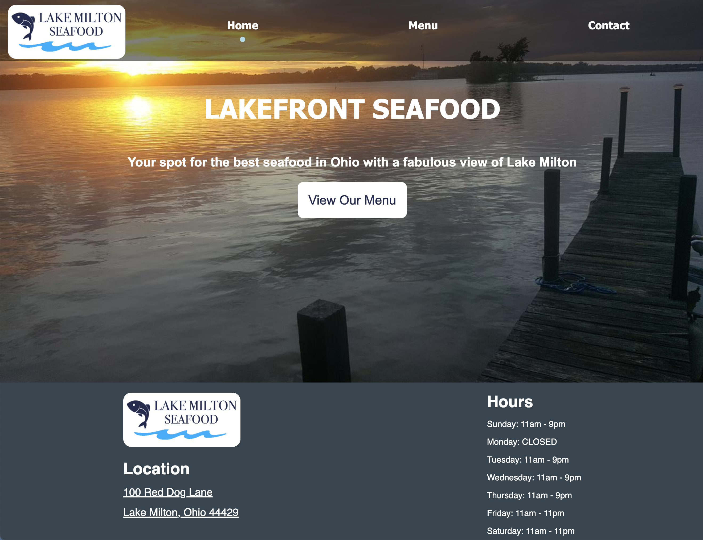

# Restaurant-Page

This is a mock restaurant website that I created using HTML, CSS, and JavaScript. This project was my first time using webpack to import and export files to different locations.

One key feature of this website is that there is only one HTML file for the project, so the different sections (Home, Menu, Contact) of the website are all being made using DOM manipulation with JavaScript. Overall, I think that I was able to make an aesthetically pleasing website for a totally ficticious website while getting to get practice with webpack and JavaScript DOM manipulation.

[Live Preview](https://ryancole25.github.io/Restaurant-Page)

Here is a screenshot of the site:

